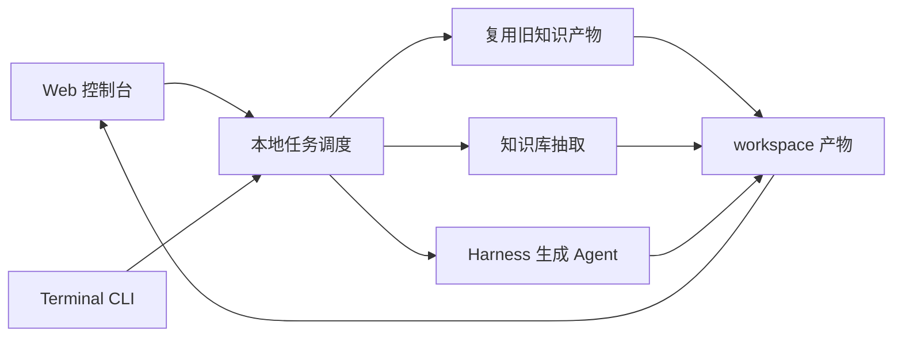

# AxF 精简架构

AxF 当前只保留一条清晰的本地流水线：

```text
Web 控制台 / Terminal CLI -> 任务调度 -> kRepo 知识抽取或复用 -> Harness 生成 Agent -> native/WSL 编译修复 -> 10 秒试跑 -> workspace 产物
```

## 分层

### 1. 前端层

位置：`frontend/`

职责：

- 提供本地 Web 控制台和无第三方依赖的 Terminal CLI。
- 收集源码路径、可选知识库复用目录、函数名、文件过滤、模型配置和产物选择。
- 将表单分成 `kRepo 知识抽取` 和 `AxF 后续流程`。
- 展示细粒度任务状态、事件、日志和产物。
- 将产物分成 `kRepo 知识产物` 和 `Harness 生成 Agent 产物`。

前端不直接拼 prompt，不直接解析模型响应，也不直接编译或运行 fuzz target。

Terminal CLI 使用同一个 `build_steps()` 构造任务。默认同步运行；加 `--async` 后会创建任务目录、写入 `config.json`，并启动后台 worker。

### 2. 任务调度层

位置：`frontend/server.py`

职责：

- 把一次用户提交转换为线性步骤。
- Windows 上在执行知识抽取前检查 `rg`，缺失时尝试通过 Scoop 安装 `ripgrep`。
- 顺序执行知识抽取命令和 Agent 命令。
- 当配置 `knowledge_dir` 时，优先复用本次已选择且旧目录中存在的知识产物；未选择的产物不复用、不生成、不进入 prompt。
- 将任务状态、事件、日志和产物路径写入 `workspace/web/tasks/<task_id>/`。
- 读取 `harness_spec.json`，把 Harness 编译和 libFuzzer 试跑结果展开成前端事件。
- 对 `生成 Fuzz Harness` 任务做最终判定：只有 `run.status == success` 才标记为成功；编译失败、试跑失败、只生成未编译或缺少 `harness_spec.json` 都标记为失败，同时保留产物。

当前 Web 调度保持简单：单进程、本地线程、顺序执行。Terminal 异步模式通过独立后台 worker 进程运行，不依赖 Web 服务。后续需要统一并发、队列、重试或暂停时，再独立抽出 `scheduler/`。

### 3. 知识库层

位置：`knowledge_base/`

职责：

- 基于 `BROWSE.VC.DB` 查询目标函数。
- 生成 `report.json`。
- 生成目标函数和下游子函数源码包，并为 `subsource` 分析包按需合成最小编译支撑，便于语法检查。
- 查询宏、typedef、枚举、变量、结构体、union 等非函数符号源码片段。
- 输出上层调用链和参数约束。

知识库层只产出上下文，不生成 harness。

### 4. Agent 层

位置：`agents/`

当前 Agent：

- `agents/harness_generation/`：基于目标函数信息和用户选择的知识库产物生成 `libFuzzer` harness，并负责本地编译、编译失败后的 LLM 修复和 10 秒短跑验证。

Harness 生成 Agent 支持两条模型通道：

- API 模式：OpenAI-compatible Chat Completions，默认流式响应。
- opencode CLI 模式：`nga`、`opencode`、`hac` 或 `claude`。其中 `nga` / `opencode` 会创建 `harness/opencode_workspace/context/prompt.md`，再用短指令让 code agent 读取该 prompt。

修复轮只要求模型返回本轮需要修改的文件。调度层和 Agent 通过 `harness_spec.json`、`compile.log`、`run.log`、`llm_response.json`、`llm_transcript.md`、`nga_interactions/` 和 opencode 工作区 prompt 对外暴露可审计结果。`nga` 模式下 transcript 记录所有交互，并按 oss-fuzz-gen 的 raw output 思路把每次尝试拆到 `nga_interactions/<attempt>/`；其他模式下 transcript 只记录有效 harness 输出。

后续 Agent 作为同级目录增加，例如：

- `agents/harness_execution/`
- `agents/crash_analysis/`
- `agents/seed_generation/`

每个 Agent 都应该有独立命令行入口，前端或调度层只通过命令参数和文件产物与它交互。

### 5. 产物层

位置：`workspace/`

职责：

- 保存任务输入、事件、日志和产物。
- 避免污染源码树、Linux 源码和知识库代码。

Web 任务写入 `workspace/web/tasks/<task_id>/`。Terminal 任务写入 `workspace/terminal/tasks/<task_id>/`。两者目录结构保持一致，便于互相复用知识产物。

典型任务目录：

```text
workspace/web/tasks/<task_id>/
  task.json
  config.json                  # Terminal --async 提交时额外保存
  task.log
  events.jsonl
  report.json
  <function>_subsource_bundle.c
  calls.txt
  params.txt
  generated_harness.txt
  harness/
    harness.c
    mocks.h
    mocks.c
    build.sh
    build.ps1
    harness_spec.json
    compile.log
    run.log
    llm_response.json
    llm_transcript.md                 # nga 全量记录；其他模式仅有效 harness 输出生成
    nga_interactions/                 # 仅 nga 模式
      01_initial_generation/
        prompt.md
        combined.rawoutput
        metadata.json
    opencode_workspace/               # 仅 nga / opencode 模式
      TASK.md
      context/prompt.md
```

旧任务目录可以作为新任务的 `knowledge_dir`。复用时会复制 `report.md`、`report.json`、`<function>_source_bundle.c`、`<function>_subsource_bundle.c`、`calls.txt` 或 `params.txt` 中被本次选择且存在的文件。

## 当前执行流



## 设计原则

- 本地优先：源码、任务和产物都保存在本机。
- 边界清楚：前端调度任务，知识库抽取上下文，Agent 生成结果。
- 文件协议优先：早期用文件连接组件，避免过早引入数据库和服务拆分。
- Agent 可插拔：新增 Agent 时只新增目录、入口和产物映射，不改知识库核心。
- 不修改外部源码：不改 Linux 源码，不改 kRepo 来源代码，只写 `workspace/`。
