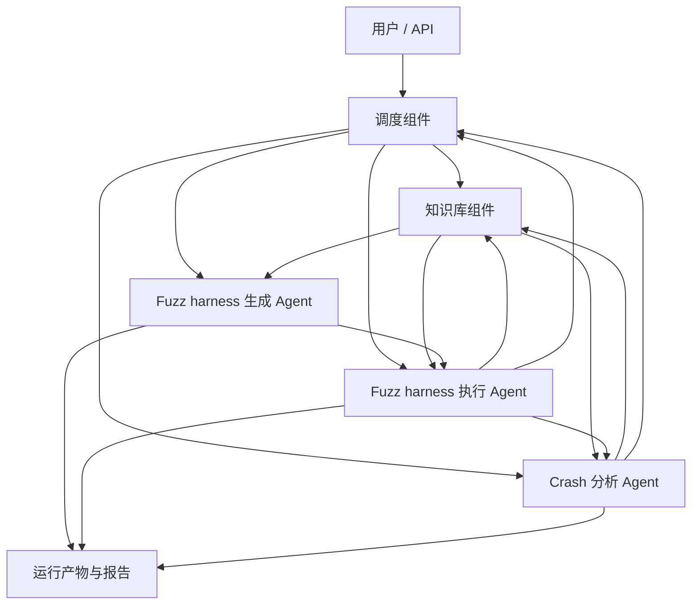
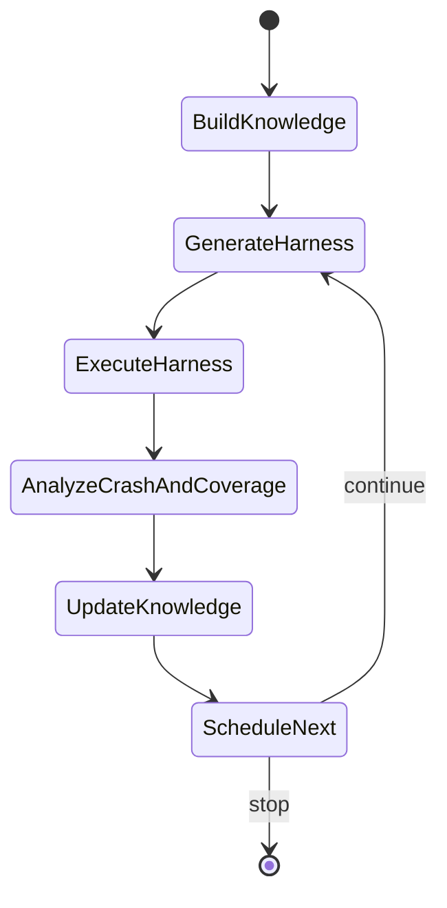

# Knowledge-based multi-agent Fuzz harness generation platform

## 1. 文档目标

本文档用于指导项目早期工程开发，目标是定义 Knowledge-based multi-agent Fuzz harness generation platform 的高层架构。

中文名称：基于知识库的多智能体 Fuzz Harness 生成平台。

本文中的 Fuzz harness 生成特指面向 `libFuzzer` 的 harness 生成，即生成符合如下入口形式的 C/C++ fuzz harness：

```cpp
extern "C" int LLVMFuzzerTestOneInput(const uint8_t *Data, size_t Size);
```

初始设计阶段不追求覆盖所有实现细节，而是优先明确：

- 平台解决什么问题。
- 核心组件有哪些。
- 组件之间如何协作。
- 哪些能力由 Agent 完成。
- 后续工程开发中如何逐步演进。

后续随着代码实现、实验反馈和需求变化，再逐步补充数据结构、接口协议、任务状态机、存储设计、Prompt 模板、覆盖率统计细节和 Crash 分类规则。

## 2. 设计背景

平台重点参考两类思路：

- `FuzzAgent: Multi-Agent System for Evolutionary Library Fuzzing`：强调多 Agent 协作、执行反馈、覆盖率驱动和 Crash 驱动的迭代式 fuzzing。
- `PromeFuzz: A Knowledge-Driven Approach to Fuzzing Harness Generation with Large Language Models`：强调知识库、API 语义、代码元数据、文档知识、API 相关性和运行反馈对 harness 生成质量的提升。

本平台的核心思想是：将目标库相关知识沉淀到知识库中，再由多个面向 fuzzing 生命周期的 Agent 使用这些知识完成 harness 生成、harness 执行、种子生成、Crash 分析和反馈迭代。

## 3. 平台目标与边界

### 3.1 平台目标

平台目标是围绕 C/C++ 库构建一个 AI 辅助的 `libFuzzer` harness 生成与执行闭环：

1. 从目标库中提取 API、类型、文档、示例和历史执行反馈等知识。
2. 基于知识库生成符合 `libFuzzer` 规范的 fuzz harness。
3. 基于知识库生成或优化 Fuzz 种子输入。
4. 执行 fuzz harness，收集 Crash、覆盖率、运行日志和新种子。
5. 分析 Crash，定位问题，并区分真实库缺陷与 harness 误用。
6. 将编译失败、执行反馈、Crash 结论和覆盖率信息回写知识库。
7. 由调度组件组织下一轮生成、执行和分析。

### 3.2 初始边界

初始版本聚焦以下范围：

- 目标对象：C/C++ 库。
- Fuzz 引擎：`libFuzzer`。
- harness 入口：`LLVMFuzzerTestOneInput`。
- 核心目标：跑通“知识库 -> harness 生成 -> 种子生成 -> 执行 -> Crash/覆盖率分析 -> 反馈”的最小闭环。

初始版本暂不强求：

- 完整 Web 平台。
- 复杂权限系统。
- 多租户资源管理。
- 完整漏洞管理流程。
- 覆盖所有构建系统和所有 C++ 高级语言特性。
- 细粒度数据库 schema 和微服务拆分。

## 4. 核心架构

平台由五个核心组件组成：

1. 知识库组件
2. Fuzz harness 生成 Agent
3. Fuzz harness 执行 Agent
4. Crash 分析 Agent
5. 调度组件

整体架构如下：



高层数据流：

1. 知识库组件沉淀目标库知识，为各 Agent 提供上下文。
2. 调度组件根据当前状态选择下一步任务。
3. Fuzz harness 生成 Agent 使用知识库和大模型生成 `libFuzzer` harness。
4. Fuzz harness 执行 Agent 使用知识库和大模型生成更好的 Fuzz 种子，并执行 harness。
5. Crash 分析 Agent 使用知识库和大模型分析执行结果、定位 Crash，并统计覆盖率。
6. 执行结果、Crash 结论、覆盖率信息和有效种子回写知识库，支撑下一轮迭代。

## 5. 核心组件职责

### 5.1 知识库组件

知识库组件是平台的上下文基础，负责组织目标库相关知识，并为各 Agent 提供可检索、可复用的信息。

当前知识库组件的初始实现已归档在 `knowledge_base/src/`，其能力说明见 [知识库组件说明](knowledge_base/README.md)，CLI 与 Python 调用方式见 [cpp_meta_query API 文档](api/knowledge_base/cpp_meta_query.md)。该实现来自 `wffx/kRepo` 的 C/C++ 元数据知识抽取能力，主要面向函数级源码上下文、依赖代码片段、上层调用链和入参约束抽取。

初始知识来源包括：

- 源码和头文件。
- API 声明和类型信息。
- README、文档、注释和示例。
- 单元测试、示例程序和已有 fuzz target。
- 编译错误、执行日志、Crash 分析结论和覆盖率反馈。
- 有效 harness、有效种子和历史误用约束。

初始知识类型包括：

- API 知识：API 名称、声明、参数、返回值、可见性。
- 类型知识：结构体、类、枚举、typedef、依赖类型。
- 语义知识：API 功能、前置条件、生命周期、错误处理方式。
- 调用知识：初始化、调用、释放等常见调用序列。
- 输入知识：文件格式、协议字段、magic bytes、关键 token、样例输入。
- 反馈知识：编译失败原因、harness 误用、Crash 结论、覆盖率瓶颈。

结合当前已归档实现，知识库组件在初始阶段优先覆盖：

- 函数源码和依赖代码片段抽取。
- 目标函数及下游子函数源码分析包导出。
- 上层调用链查询。
- 函数入参约束推断。

这些能力优先服务于 Fuzz harness 生成 Agent，帮助其构造 API 调用上下文；也服务于 Fuzz harness 执行 Agent 和 Crash 分析 Agent，用于推断种子约束、分析调用路径和定位 harness 误用。

初始阶段可以先采用简单存储形式，例如文件目录、JSON、SQLite 或轻量索引；后续再根据规模演进为图数据库、向量数据库和结构化数据库组合。

### 5.2 Fuzz harness 生成 Agent

Fuzz harness 生成 Agent 负责根据知识库输入，与大模型交互生成 `libFuzzer` harness。

主要职责：

- 选择或接收目标 API。
- 从知识库检索 API 声明、类型依赖、调用序列、文档约束和历史反馈。
- 生成 `LLVMFuzzerTestOneInput` harness 代码。
- 根据编译错误和运行早期反馈修复 harness。
- 将成功和失败经验回写知识库。

生成的 harness 应满足：

- 使用 `LLVMFuzzerTestOneInput` 作为入口。
- 正确处理 `Data` 和 `Size`。
- 尽量满足目标 API 的初始化、调用、清理和错误处理要求。
- 避免由 harness 自身造成明显误报。

初始阶段只需要支持单文件 harness 生成和基础编译修复；后续再扩展到多 API 组合、复杂对象构造、状态机路径和多 harness 合并。

### 5.3 Fuzz harness 执行 Agent

Fuzz harness 执行 Agent 负责组织 `libFuzzer` harness 执行，并根据知识库输入通过大模型生成或优化 Fuzz 种子。

主要职责：

- 编译和运行生成的 `libFuzzer` harness。
- 从知识库检索输入格式、协议关键字、历史有效种子和 Crash 种子。
- 通过大模型生成更适合目标 API 或输入格式的初始种子。
- 管理初始种子、生成种子、运行时新种子和 Crash 输入。
- 收集执行日志、Crash、超时、OOM 和原始覆盖率数据。
- 将执行结果和有效种子反馈给知识库与调度组件。

种子输入在初始阶段可以分为：

```text
corpus/
  initial/     # 来自样例、测试、公开数据或手工准备的初始种子
  generated/   # Agent 基于知识库和大模型生成的种子
  runtime/     # libFuzzer 执行过程中产生的新种子
  crash/       # 触发 Crash 的输入
```

后续可以继续补充种子最小化、种子贡献度统计、dictionary 生成和 coverage-guided seed generation。

### 5.4 Crash 分析 Agent

Crash 分析 Agent 负责通过大模型辅助分析 Fuzz 执行过程中出现的 Crash，定位具体问题，并统计覆盖率。

主要职责：

- 收集 Crash 输入、sanitizer 日志、调用栈和执行上下文。
- 结合知识库中的 API 约束、源码片段、harness 代码和历史反馈分析 Crash。
- 判断 Crash 更可能是真实库缺陷、harness 误用、环境问题还是低价值异常。
- 定位具体问题位置，例如文件、函数、调用路径和触发条件。
- 统计并摘要覆盖率，为调度组件提供下一轮目标。
- 将误用约束、真实缺陷线索、覆盖率瓶颈回写知识库。

初始阶段的 Crash 分析可以先输出结构化结论：

- Crash 类型判断。
- 关键调用栈。
- 可能根因。
- 关联 harness 代码。
- 关联 API 约束。
- 覆盖率摘要。
- 下一步建议。

后续再逐步增加自动复现、最小化、去重、漏洞报告生成和补丁建议。

### 5.5 调度组件

调度组件负责管理整体流程，决定下一步调用哪个 Agent。

主要职责：

- 管理一次 fuzzing campaign 的生命周期。
- 选择目标 API 或目标代码区域。
- 调度 harness 生成、harness 执行、Crash 分析和知识库更新。
- 根据覆盖率、Crash、种子质量和历史失败信息决定是否继续迭代。
- 控制时间预算、模型调用预算和运行资源。

初始阶段调度逻辑可以保持简单：

1. 构建知识库。
2. 选择一个或一组目标 API。
3. 调用 Fuzz harness 生成 Agent。
4. 调用 Fuzz harness 执行 Agent。
5. 调用 Crash 分析 Agent。
6. 回写知识库。
7. 如果预算允许，进入下一轮。

后续再增加覆盖率驱动调度、Crash 优先调度、种子贡献度调度和多 Agent 并发调度。

## 6. 端到端闭环

平台的最小闭环如下：



闭环说明：

- 知识库为 harness 生成提供上下文。
- Fuzz harness 生成 Agent 产出 `libFuzzer` harness。
- Fuzz harness 执行 Agent 生成种子并执行 fuzzing。
- Crash 分析 Agent 分析 Crash 并统计覆盖率。
- 分析结果回写知识库。
- 调度组件决定是否继续下一轮。

## 7. 初始工程形态

初始工程不建议过早拆分复杂微服务。可以先采用模块化单体或轻量服务组合：

```text
ai-libfuzzer-platform/
  knowledge_base/
  agents/
    harness_generation/
    harness_execution/
    crash_analysis/
  scheduler/
  tools/
    build/
    libfuzzer/
    coverage/
    crash/
  workspace/
  docs/
  tests/
```

初始 workspace 可以保持简单：

```text
workspace/
  source/
  knowledge/
  harnesses/
  corpus/
  runs/
  reports/
```

随着开发推进，再逐步细化为独立服务、数据库、任务队列、Web 控制台和更严格的产物管理。

## 8. 演进路线

### Phase 0：最小闭环

目标：跑通一个最小可用流程。

范围：

- 导入目标库源码。
- 抽取基础 API 信息。
- 生成一个 `LLVMFuzzerTestOneInput` harness。
- 生成一批初始种子。
- 执行 `libFuzzer`。
- 收集 Crash 和基础覆盖率。
- 将结果写回知识库。

### Phase 1：知识库增强

目标：提升 harness 生成质量。

可能增强：

- API 语义摘要。
- 类型依赖关系。
- 文档和示例检索。
- API 调用序列。
- harness 误用约束。

### Phase 2：执行与种子增强

目标：提升 fuzzing 执行效果。

可能增强：

- 基于输入格式生成种子。
- 基于 API 约束生成种子。
- 引入 dictionary。
- 保存运行时有效种子。
- 初步统计种子贡献度。

### Phase 3：Crash 与覆盖率分析增强

目标：提升反馈质量。

可能增强：

- Crash 去重。
- Crash 复现。
- Crash 最小化。
- 覆盖率归因。
- harness 误用和真实缺陷区分。
- 漏洞报告草稿。

### Phase 4：调度优化

目标：从线性流程演进为反馈驱动流程。

可能增强：

- 覆盖率驱动目标选择。
- Crash 优先分析。
- 种子贡献度驱动执行。
- 多轮 harness 生成。
- 多 Agent 并发。

### Phase 5：平台化

目标：支撑更稳定、更大规模的使用。

可能增强：

- Web 控制台。
- 任务队列。
- 资源隔离。
- 多项目管理。
- 报告导出。
- 成本和审计能力。

## 9. 初始验收标准

第一版建议以端到端闭环为验收目标：

1. 能输入一个本地 C/C++ 库源码目录。
2. 能抽取基础 API 信息并写入知识库。
3. 能生成至少一个 `LLVMFuzzerTestOneInput` harness。
4. 能基于知识库生成或准备初始种子。
5. 能执行 `libFuzzer` 并保存运行日志。
6. 能收集 Crash 输入和基础覆盖率。
7. 能输出 Crash 初步分析结论。
8. 能将 harness、种子、执行结果和分析结论回写知识库。

## 10. 后续待补充内容

以下内容不需要在初始设计中完全展开，建议在开发过程中逐步补充：

- 知识库 schema。
- Agent 输入输出协议。
- Prompt 模板。
- 调度状态机。
- 覆盖率统计口径。
- Crash 分类规则。
- 种子生成格式。
- harness 编译和运行参数。
- 产物目录规范。
- 数据库和服务拆分设计。
- 评估指标和 benchmark 选择。
